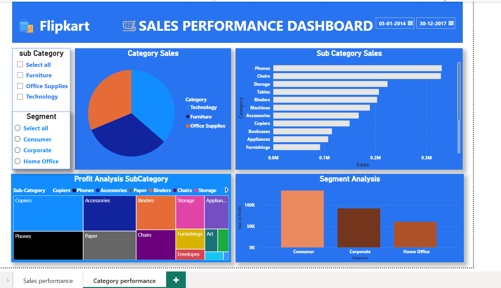

# 📊 Flipkart Sales Analysis | Power BI & Python

## 📌 Project Overview
This project analyzes the Superstore sales dataset using Python for data cleaning and exploratory data analysis (EDA), followed by the creation of an interactive Sales Performance Dashboard in Power BI. The dashboard provides business insights into sales, profit, orders, categories, regions, and customer segments.

---

## 🚀 Tools & Technologies
- Python
- Jupyter Notebook
- Pandas
- NumPy
- Matplotlib
- Power BI
- Power Query
- DAX
- Microsoft Excel

---

## 📂 Project Workflow
1. Imported the Superstore dataset into Jupyter Notebook.
2. Performed data cleaning and preprocessing using Pandas.
3. Conducted Exploratory Data Analysis (EDA) to identify sales and profit trends.
4. Imported the cleaned data into Power BI.
5. Built an interactive dashboard using Power BI with slicers, KPIs, and charts.
6. Generated business insights to support data-driven decision making.

---

## 📈 Dashboard Features
- Total Sales KPI
- Total Profit KPI
- Total Orders KPI
- Monthly Sales Analysis
- Monthly Profit Analysis
- Category-wise Sales Analysis
- Sub-Category Sales Analysis
- Segment Analysis
- Interactive Filters (Month, City, State, Category, Region, Segment)

---

## 📁 Project Files
- 📒 Flipkart_Sales_Analysis.ipynb
- 📊 Flipkart Sales Dashboard.pbix
- 📄 Superstore.xlsx
- 🖼️ sales-performance-dashboard.png
- 🖼️ category-performance-dashboard.png

---

## 📷 Dashboard Preview

### Sales Performance Dashboard
(sales-performance-dashboard.png)

### Category Performance Dashboard

---

## 📌 Key Insights
- Identified monthly sales and profit trends.
- Compared sales across different categories and sub-categories.
- Analyzed customer segments and regional performance.
- Designed an interactive dashboard for business reporting.

---

## 👩‍💻 Author
**Shiwangi Chaurasiya**
