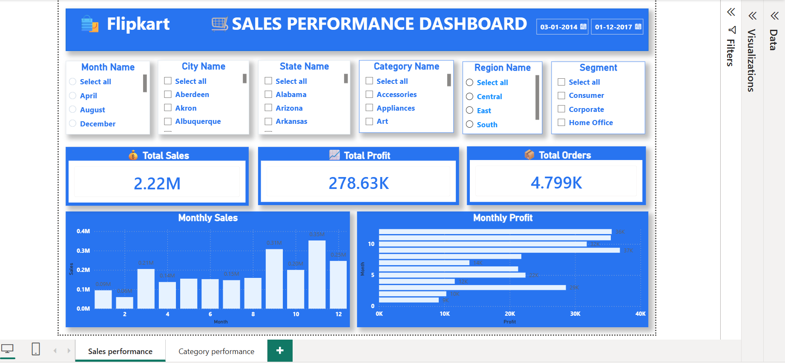

# 📊 Flipkart Sales Analysis using Python & Power BI

## 📌 Project Overview

This project focuses on analyzing the Superstore sales dataset to uncover meaningful business insights through data analysis and interactive visualization. The project was completed in two phases:

- **Python (Jupyter Notebook):** Used for data cleaning, preprocessing, exploratory data analysis (EDA), and interactive visualizations using Plotly.
- **Power BI:** Used to build an interactive business dashboard with KPIs, charts, and slicers for better decision-making.

The dashboard helps analyze sales performance, profit trends, customer segments, regional performance, product categories, and monthly business growth.

---

## 🎯 Project Objectives

- Clean and preprocess raw sales data.
- Perform Exploratory Data Analysis (EDA).
- Identify monthly sales and profit trends.
- Analyze category and sub-category performance.
- Compare sales across different regions and customer segments.
- Build an interactive dashboard for business reporting.
- Generate actionable insights for decision-making.

---

## 🛠️ Tools & Technologies

- Python
- Jupyter Notebook
- Pandas
- NumPy
- Plotly
- Power BI
- Power Query
- DAX
- Microsoft Excel

---

## 📂 Project Workflow

### Phase 1: Data Analysis using Python

- Imported the Superstore dataset into Jupyter Notebook.
- Cleaned missing values and removed duplicate records.
- Converted data into appropriate formats.
- Performed Exploratory Data Analysis (EDA).
- Created interactive charts using Plotly.
- Analyzed sales, profit, categories, regions, and customer segments.

### Phase 2: Dashboard Development using Power BI

- Imported the processed dataset into Power BI.
- Performed additional data transformation using Power Query.
- Created calculated columns for Month, Year, and Day of Week.
- Built DAX measures for KPIs.
- Designed an interactive dashboard using cards, bar charts, line charts, donut charts, and slicers.
- Applied a Flipkart-inspired blue theme for a clean and modern user interface.

---

## 📊 Dashboard Features

- 📌 Total Sales KPI
- 💰 Total Profit KPI
- 📦 Total Orders KPI
- 📈 Monthly Sales Trend
- 📉 Monthly Profit Trend
- 🛒 Category-wise Sales Analysis
- 📦 Sub-Category Performance
- 🌍 Regional Sales Analysis
- 👥 Customer Segment Analysis
- 🎛️ Interactive Slicers
  - Region
  - State
  - Category
  - Segment
  - Year

---

## 📈 Key Business Insights

- Identified top-performing product categories.
- Compared sales and profit across different regions.
- Analyzed monthly sales and profit growth.
- Evaluated customer segment contribution.
- Identified high-profit and low-profit sub-categories.
- Built an interactive dashboard for quick business reporting.

---

## 📁 Repository Structure

```
Flipkart-Sales-Analysis/
│
├── Flipkart_Sales_Analysis.ipynb
├── Flipkart Sales Dashboard.pbix
├── Superstore.xlsx
├── sales-performance-dashboard.png
├── category-performance-dashboard.png
└── README.md
```

---

## 📷 Dashboard Preview

### 📊 Sales Performance Dashboard



### 📊 Category Performance Dashboard


---

## 🚀 Future Improvements

- Add sales forecasting using Python.
- Connect Power BI with SQL Server.
- Publish the dashboard using Power BI Service.
- Automate data refresh.
- Add advanced DAX measures for deeper business insights.

---

## 👩‍💻 Author

**Shiwangi Chaurasiya**

**Skills:** Python | Pandas | NumPy | Plotly | Power BI | Power Query | DAX | Excel

⭐ If you found this project useful, don't forget to give this repository a star.
